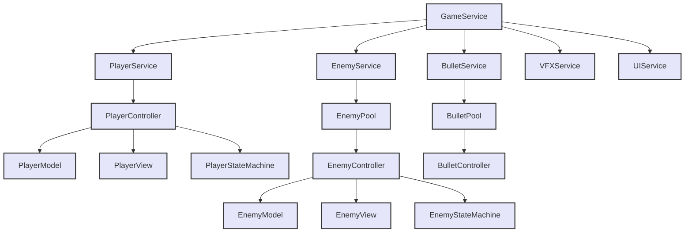

# 2D Action Platformer | Unity | C#

A combat-focused platformer with progression mechanics where players collect Dragon Balls to unlock Super Saiyan transformation. Built with scalable architecture supporting multiple enemy types and dynamic combat states.

**Tech Stack:** Unity 2D | C# | State Machines | Object Pooling | ScriptableObjects

---

## Development Approach

I structured the game using MVC + Service Layer to separate concerns and avoid MonoBehaviour coupling. GameService acts as the central coordinator - when an enemy fires a bullet, the flow is: EnemyController → GameService.bulletService → BulletPool → BulletController. This made it straightforward to add new enemy types without touching existing systems.

All gameplay data lives in ScriptableObjects (player stats, enemy health, bullet damage). During testing, I could adjust enemy attack patterns in the inspector and immediately see the impact without recompiling. State changes propagate through events - when the player transforms to Super Saiyan, PlayerModel broadcasts the change, and UI/Camera systems respond independently.


---

## Key Technical Systems

### Generic Object Pooling

My initial implementation spawned/destroyed bullets and VFX on every action, causing spikes during boss fights. I built a generic pool system that pre-instantiates objects and reuses them:
```csharp
public class GenericObjectPool<T> where T : IPoolable
{
    private List<PooledItem<T>> pool = new List<PooledItem<T>>();
    
    public T GetItem(System.Type type)
    {
        foreach (var item in pool)
        {
            if (!item.isUsed && item.controller.GetType() == type)
            {
                item.isUsed = true;
                return item.controller;
            }
        }
        return CreateController(type);
    }
}
```

The pool tracks `PooledItem<T>` with an `isUsed` flag. When requesting an object, it searches for an unused instance matching the type. If none exist, it creates one. The key was making this work with inheritance - GuidedBulletPool extends BulletPool and overrides `CreateController()` to instantiate the correct subclass. This reduced frame allocations from ~800KB to near-zero during combat.

### Hierarchical State Machines

Both player and enemies use state machines, but I needed different transition logic for each. I created PlayerStateMachine and EnemyStateMachine that manage their own state dictionaries and transitions.

The challenge was shared state checking. Initially, every state duplicated the death check:


I refactored by creating a `PlayerStateBase` class that handles common transitions in its `Update()`:
```csharp
public abstract class PlayerStateBase
{
    public virtual void Update()
    {
        if (playerModel.IsDead)
        {
            stateMachine.ChangeState(PlayerStates.Death);
            return;
        }
        
        if (playerModel.IsTransforming)
        {
            stateMachine.ChangeState(PlayerStates.Transform);
            return;
        }
    }
}
```

Each state calls `base.Update()` first, then handles state-specific logic. This eliminated 50+ lines of duplicate code and centralized transition priority (death > transform > attack).


### Super Saiyan Transformation System

The transformation needed to modify multiple systems (health, stamina, speed, camera) without them knowing about each other. I solved this with multiplicative buffs in PlayerModel:
```csharp
public void ApplySuperSaiyanBuffs()
{
    baseMaxHealth = maxHealth;
    baseMaxStamina = maxStamina;
    baseSpeed = speed;
    
    maxHealth *= 2f;
    maxStamina *= 1.5f;
    speed *= 1.3f;
    
    // Maintain percentage
    float healthPercent = currentHealth / baseMaxHealth;
    currentHealth = maxHealth * healthPercent;
}
```

When the transformation triggers:

- TransformState calls `PlayerModel.ApplySuperSaiyanBuffs()`
- Model updates internally, UI reads the new values in its `Update()`
- Camera checks `PlayerView.IsSuperSaiyan` and adjusts orthographic size
- New abilities (Fly, Vanish, Kamehameha) become available through state checks

Reverting works the same way - calculate percentage, apply base values, restore percentage. The key insight was storing both base and modified values so reversion doesn't lose precision:
```csharp
public void RemoveSuperSaiyanBuffs()
{
    float healthPercent = currentHealth / maxHealth;
    maxHealth = baseMaxHealth;
    currentHealth = maxHealth * healthPercent;
}
```

### Flight Mode Mechanics

Flying required disabling gravity and controlling vertical movement. In `FlyState.OnStateEnter()`, I set `Rigidbody.gravityScale = 0` and use input direction for velocity:
```csharp
public override void Update()
{
    Vector2 input = playerController.GetMovementInput();
    rb.velocity = new Vector2(input.x * flySpeed, input.y * flySpeed);
}
```

The issue was vertical momentum - when releasing the stick, the player kept drifting. I added exponential dampening when input is neutral:
```csharp
if (input.magnitude < 0.1f)
{
    rb.velocity *= 0.85f; // Exponential decay
}
```

This creates a responsive feel where the player stops quickly but maintains momentum during active input.

### Boss Enemy AI

The final boss needed distinct phases without creating separate controllers. I extended `BaseEnemyModel` to `FinalBossTypeEnemyModel` with additional state:
```csharp
public bool HasRegeneratedOnce { get; set; }
public bool IsRegenerating { get; private set; }
public bool IsEnraged { get; set; }
```

When health drops below 50%, two things can happen:

- **First time:** Boss plays regeneration animation, heals to full, gets enraged
- **After that:** Boss just enters enraged mode (faster attacks, more damage)

The regeneration was tricky because I needed to freeze all AI during the animation. I added `IsRegenerating` flag that:

- **Blocks damage:** `if (IsRegenerating) return;` in `TakeDamage()`
- **Pauses states:** AttackState checks `CanAttack()` which returns false if regenerating
- **Locks movement:** `FinalBossView.MoveInDirection()` early-exits if regenerating

The animation uses a coroutine that pulses the sprite color:
```csharp
IEnumerator RegenerationAnimation()
{
    for (int i = 0; i < 10; i++)
    {
        spriteRenderer.color = Color.yellow;
        yield return new WaitForSeconds(0.1f);
        spriteRenderer.color = Color.white;
        yield return new WaitForSeconds(0.1f);
    }
    OnRegenerationComplete();
}
```

After completion, it calls `FinalBossController.OnRegenerationAnimationComplete()` which sets `IsRegenerating = false` and updates health. This pattern let me add complex multi-stage behaviors without breaking the base state machine.

### Rapid Fire Attack Pattern

The boss fires spread patterns instead of single bullets. In FinalBossView, the attack state randomly chooses between:

- **Regular fire:** One guided bullet
- **Rapid fire:** 3 bullets per burst for 3 seconds at 0.2s intervals

Each burst calculates spread angles:
```csharp
float[] angles = { -15f, 0f, 15f };
foreach (float angle in angles)
{
    Vector2 direction = Quaternion.Euler(0, 0, angle) * targetDirection;
    FireBullet(direction);
}
```

This creates a cone of projectiles that force the player to dodge, making the boss more dynamic than standard enemies.

---

## Technical Challenges

**Guided Bullet Physics:** Enemy bullets needed to home in on the player. I extended BulletController to GuidedBulletController that calculates target direction each frame:
```csharp
void FixedUpdate()
{
    if (Time.time < spawnTime + guidanceDelay) return;
    if (Time.time > spawnTime + maxGuidanceTime) return;
    
    Vector2 targetDir = (player.position - transform.position).normalized;
    rb.velocity = targetDir * bulletSpeed;
}
```

The problem was bullets instantly snapping to face the player. I added a `GuidanceDelay` - bullets fly straight for 0.5s, then start homing. This gives players reaction time. Also added `MaxGuidanceTime` so bullets stop tracking after 5s and fly straight, preventing infinite chasing.

**Animation Event Coupling:** Enemy attacks triggered damage through animation events, but this created tight coupling between animations and code. Moving to a time-based system was cleaner:
```csharp
if (stateTime >= attackWindup && !hasDealtDamage)
{
    DealDamage();
    hasDealtDamage = true;
}
```

Now I can adjust animation length without updating code, and attacks always land at the right frame.

**Camera Shake During Combat:** I needed camera shake on hits without manually calling it everywhere. The solution was a CameraShakeService that applies shake as an offset:
```csharp
public void ShakeCamera(float intensity, float duration)
{
    shakeIntensity = intensity;
    shakeDuration = duration;
}

void LateUpdate()
{
    if (shakeDuration > 0)
    {
        Vector3 offset = Random.insideUnitCircle * shakeIntensity;
        transform.position += offset;
        shakeDuration -= Time.deltaTime;
    }
}
```

The camera calls this in `LateUpdate()`, and any system triggers shake by calling `ShakeCamera(intensity, duration)`. This decoupled shake logic from damage calculation.

---

## What I Learned

Building multiple enemy types taught me the value of polymorphism - `BaseEnemyController` defines the contract, and `KickTypeEnemy`, `FlyingTypeEnemy`, `FinalBossTypeEnemy` override specific methods. The factory pattern in `EnemyPool.CreateEnemyController()` switches on type to instantiate the correct subclass, letting me add new enemies without modifying existing code.

State machines need careful priority ordering. Initially, my player could attack while dead because attack input was checked before death. Moving common transitions to `PlayerStateBase.Update()` and using early returns fixed this - now death always takes precedence. The lesson was check critical states first, then delegate to state-specific logic.

Generic pooling saved time when I needed VFX and enemy pooling after building bullet pooling. The `GenericObjectPool<T>` took extra upfront design but paid off immediately. I learned to recognize patterns early and build reusable systems rather than duplicating code.

## Play Link
- https://sayannandi.itch.io/dragon-ball-path-to-fire

---

[](https://youtu.be/pTavSzk228w)
### [Gameplay Video](https://youtu.be/pTavSzk228w)


